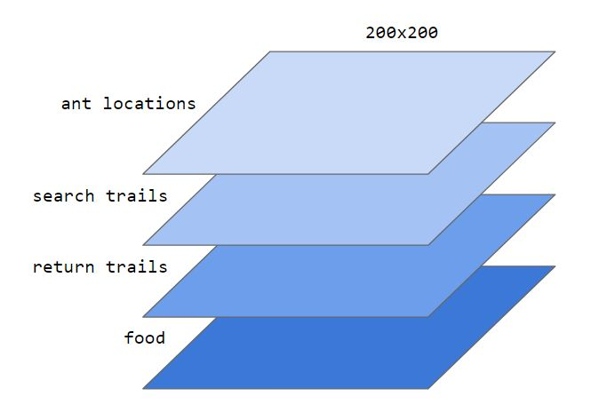
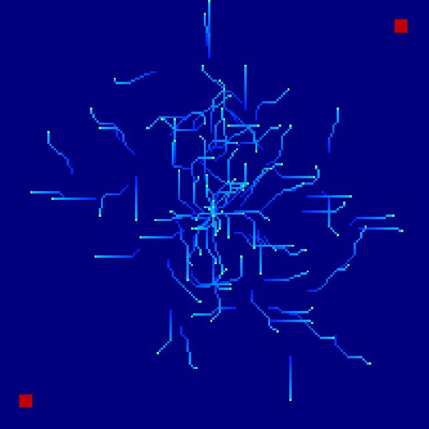
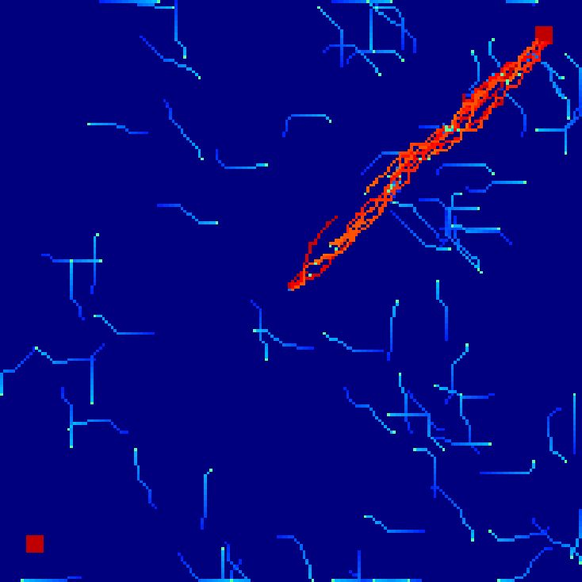
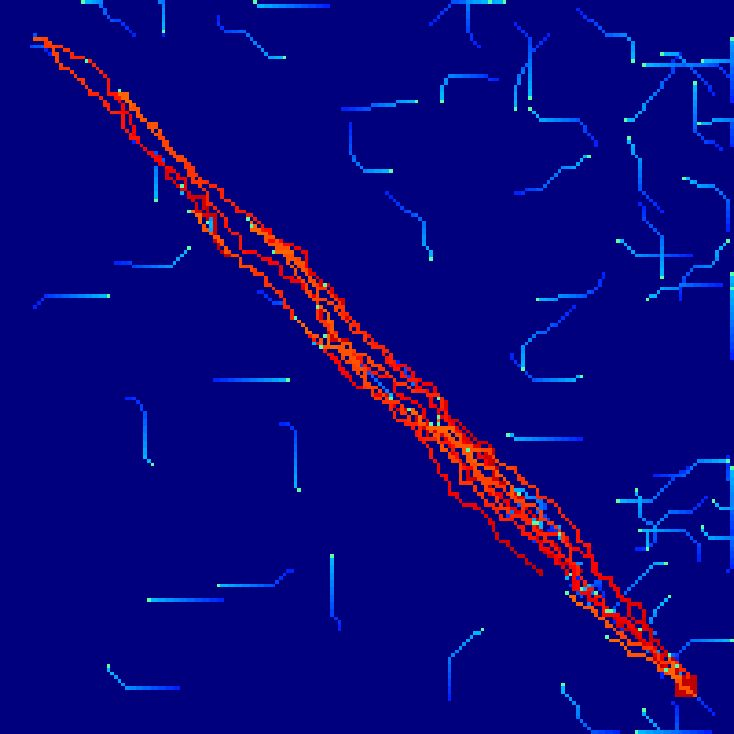
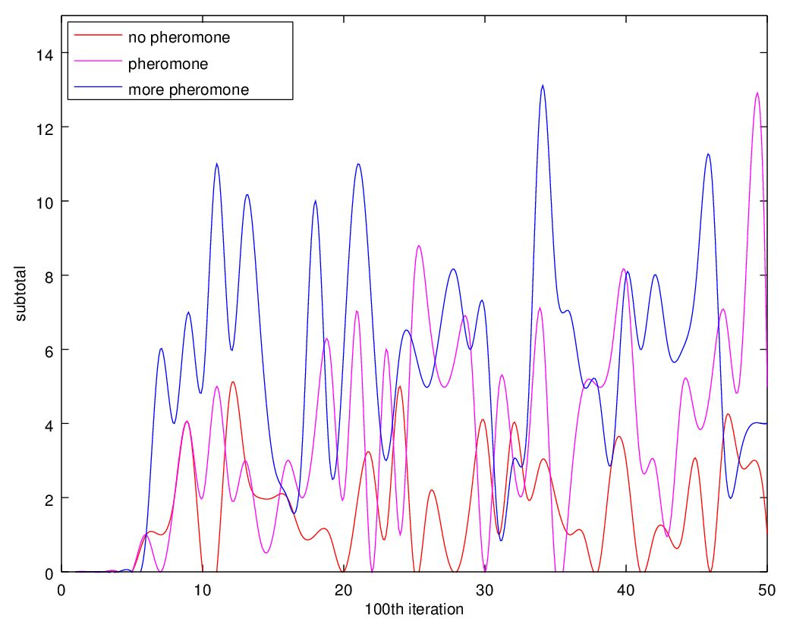

# Ant Colony

This is a simulation of an ant colony that demonstrates ant collaboration through the use of _pheromone trails_. The simulation states are divided into 4 layers:

When the simulation starts, ants crawl out of their nest (center) and randomly traverse the map in search for food (red squares):

When an ant finds food, it brings it back to the nest while leaving behind a pheromone trail. When other ants hit a pheromone trail, they follow it towards the food. This allows ants to collaborate indirectly, emulating intelligent behavior:

This allows for efficient food collection, even over long distances, because the ants that find food by following a pheromone trail continue to reinforce the path to the food:

Using pheromone trails has a clear advantage over pure random search:

